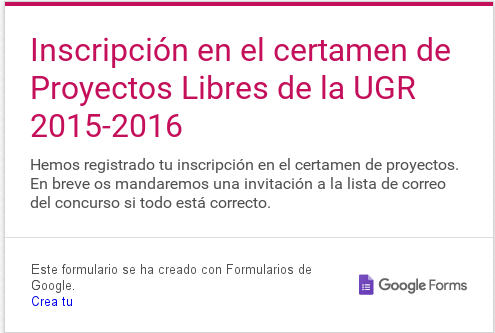

# Try-2-Learn
## Proyecto para la asignatura IV 2015-16
###Descripción 
Dada la naturaleza de la asignatura el proyecto debe orientarse hacia las tecnologías
SaaS/PaaS/IaaS.

Try2Learn tiene como objetivo el testeo de scripts o pequeños módulos en diversos lenguajes de forma que el usuario no se tenga que preocupar de crear un entorno específico para testear sus scripts en su lenguaje favorito online.

###Funcionamiento
Try2Learn nos permite crear un entorno virtual aislado y preparado para el lenguaje de nuestra aplicación. El usuario manda su código fuente o un paquete y Try2Learn le devuelve la salida del programa compilado/interpretado.

El programa se ejecutará dentro de un entorno virtualizado el cual podrá ser personalizable por el usuario.

###Objetivos iniciales
* Servidor con [nodejs](https://es.wikipedia.org/wiki/Node.js)
* Comprender y ser capaz de crear [dockers](https://es.wikipedia.org/wiki/Docker) personalizados para la virtualización de los entornos del usuario.
* Dado un código fuente sencillo [compilarlo](https://es.wikipedia.org/wiki/Compilador) o [interpretarlo](https://es.wikipedia.org/wiki/Int%C3%A9rprete_(inform%C3%A1tica)#Lenguaje_interpretado), según el lenguaje, en el servidor y devolver la salida.
* Crear interfaz web para el usuario
* Comprender y comenzar a usar [Travis](https://travis-ci.org/)

####Objetivos futuros
Una vez finalizados y probados con éxito los objetivos iniciales, se pretende afinar un poco más el proyecto dando lugar a:

* Testeo de aplicaciones web completas tipo Django o basadas en otros frameworks en entornos virtuales.
* Definir un posible sistema [freemium](https://es.wikipedia.org/wiki/Freemium) de uso, para mi propia explotación o la del que lo desee!
    
#### Inscripción en el certamen de proyectos de la UGR organizado por la OSL
Proyecto inscrito en el certamen de [Proyectos Libres de la UGR 2015-2016](http://osl.ugr.es/bases-de-los-premios-a-proyectos-libres-de-la-ugr/)

#### Integrantes del equipo
En un principio estoy yo sólo en el proyecto, aunque puede "forkearme/pull requestearme" quien lo desee!  

Si deseas contactar conmigo te sugiero me escribas a jesusgonzaleznovez@gmail.com

###Segundo hito
#### Sistema de Test
Dado que la aplicación esta basada en [node.js](https://es.wikipedia.org/wiki/Node.js) me he decidido por usar [mocha](https://mochajs.org/) porque es un framework de pruebas unitarias para JavaScript que ejecuta las pruebas en serie permitiendo reportes flexibles y exactos, es perfecto para mi proyecto basado en nodejs.

Dado que he configurado un Makefile podemos realizar los test usando:
    
    make test

#### Integración continua
Respecto a la integración continua he optado por utilizar [Travis](https://travis-ci.org/) usando
mi cuenta de GitHub [@jesusgn90](https://github.com/jesusgn90/) por su facilidad de uso y por su compatibilidad con GitHub. Lo primero que debemos hacer es crear
el fichero .travis.yml, en el cual he añadido lo siguiente:

    language: node_js
    sudo: required
    services:
      - docker
    node_js:
      - "0.10"
    before_install:
      - docker pull ubuntu:latest
      - cd app
      - make install
    script:
      - make test

En él indicamos que se ejecute en un entorno usando el lenguaje node_js versión 0.10 y que además instale las dependencias necesarias usando make install. Además deseamos que ejecute los test por eso indicamos que se ejecute make test.

####Makefile
Se ha creado un fichero Makefile que irá creciendo con el tiempo en el que podemos realizar varias tareas de una forma cómoda, a continuación se describen las opciones:

    make install - instala las dependencias del proyectos
    make run - ejecuta el servidor
    make test - realiza los test de mocha
    make doc - genera la documentación
    make clean - limpia directorios/ficheros generados por otras órdenes del makefile

####Nuevas herramientas añadidas
    Jade, como motor de plantillas
    Express, framework para NodeJS
    Docco, para generar la documentación de forma cómoda

###Tercer hito
####Despliegue en PaaS Heroku
He optado por Heroku por que lo nombraban en los ejercicios, en el temario, comencé a usarlo y con él me he quedado pues me resulta cómodo y sencillo de usar.

Mostraré como lo he realizado en el proyecto propio de las prácticas de la asignatura. El proyecto propio es [Try-2-Learn](https://github.com/jesusgn90/Try-2-Learn), pues dentro esta el directorio "app", que es la aplicación nodejs, en el he creado otro repositorio para Heroku. 

    Instalamos [Heroku Toolbelt](https://toolbelt.heroku.com/)
    $ heroku login
    $ cd app
    $ git init
    $ heroku apps:create try-2-learn

Ya tenemos creada una aplicación en Heroku llamada try-2-learn, ahora añadiremos un fichero Procfile que indica a Heroku que hacer, probablemente este fichero sea modificado con el tiempo, pero de momento indicaremos sólamente la siguiente línea:

    web: npm start

Finalmente vamos a añadir todo el subdirectorio "app" al nuevo repositorio que creamos anteriormente.

    $ heroku git:remote -a try-2-learn
    $ git add .
    $ git commit -am "prueba"
    $ git push heroku master

De esta forma hemos actualizado indicando a heroku de que repositorio debe coger el código y finalmente lo hemos desplegado. Para arrancar la aplicación para verla en un navegador ejecutamos:

    $ heroku open

Podemos verla en [https://try-2-learn.herokuapp.com/](https://try-2-learn.herokuapp.com/)

Con esto tendríamos configurada y puesta en marcha la aplicación en Heroku, ahora falta SnapCI
